# **Behavioral Cloning**

**Behavioral Cloning Project**

The goals / steps of this project are the following:
* Use the simulator to collect data of good driving behavior
* Build, a convolution neural network in Keras that predicts steering angles from images
* Train and validate the model with a training and validation set
* Test that the model successfully drives around track one without leaving the road
* Summarize the results with a written report

## Rubric Points
### Here I will consider the [rubric points](https://review.udacity.com/#!/rubrics/432/view) individually and describe how I addressed each point in my implementation.

---
### Files Submitted & Code Quality

#### 1. Submission includes all required files and can be used to run the simulator in autonomous mode

My project includes the following files:
* model.py containing the script to create and train the model
* drive.py for driving the car in autonomous mode
* model.h5 containing a trained convolution neural network
* writeup_report.md summarizing the results

#### 2. Submission includes functional code
Using the Udacity provided simulator and my drive.py file, the car can be driven autonomously around the track by executing

```sh
python drive.py model.h5
```

#### 3. Submission code is usable and readable

The model.py file contains the code for training and saving the convolution neural network. The file shows the pipeline I used for training and validating the model, and it contains comments to explain how the code works.

###Model Architecture and Training Strategy

#### 1. An appropriate model architecture has been employed

My model was build after this [Nvidia model](https://devblogs.nvidia.com/parallelforall/deep-learning-self-driving-cars/). It consists of two pre-processing layers (cropping and normalizing line 64-65), five convolution layers and four fully-connected layers. There are Relu (Rectified Linear Unit) layers interleave to introduce nonlinearity. The filter size start with 5x5 pixel and 2x2 stride in the first three convolution layers. The last two convolution layers the filter size become 3x3 and 1x1 stride.

#### 2. Attempts to reduce overfitting in the model

The model contains two dropout layers in order to reduce overfitting (model.py lines 79 and 82).

The model was trained and validated on different data sets to ensure that the model was not overfitting (line 88). The model was tested by running it through the simulator and ensuring that the vehicle could stay on the track.

#### 3. Model parameter tuning

The model used an adam optimizer, so the learning rate was not tuned manually (model.py line 87).

#### 4. Appropriate training data

Training data was chosen to keep the vehicle driving on the road. I used a combination of center lane driving, small turn and sharp turn from the left and right sides of the road.

For details about how I created the training data, see the next section.

### Model Architecture and Training Strategy

#### 1. Solution Design Approach

The overall strategy for deriving a model architecture was to get a simple baseline model up and running first before adding layers to make a complex architecture.

My first model was a simple fully conected layer. This model serves two purposes. First, to see if data flowing correctly. Second, to see the behavior of a linear model. I then used the nvidia arhitecture with different an additional pre-processing step--cropping. By examining the traning images, the top 50 pixel are mostly sky and trees which are unrelated to steering angle. The bottom 20 pixels capture the hood of the car which can also be cropped out. Since there aren't so many training data I added 2 dropout layers on first two fully connected layers to reduce overfitting.

In order to gauge how well the model was working, I split my image and steering angle data into a training and validation set. I found that by training too many epochs the model tends to be overfitting and swaying left and right. Based on my dataset, by trials and errors, I found that number of epochs between 2-5 is a sweet spot to use for training.

The final step was to run the simulator to see how well the car was driving around track one. There were a few spots where the vehicle fell off the track namely the sharp turn. To improve the driving behavior in these cases, I recorded situations which the car was recovering from understeer and oversteer.

At the end of the process, the vehicle is able to drive autonomously around the track without leaving the road.

#### 2. Final Model Architecture

Here's the final model architecture in detail (model.py lines 63-84)

Here's my model in detail:

| Layer         		        | Description	            	                			 | Input Size | Output Shape | Param # |
|:-----------------------------:|:----------------------------------------------------------:|:----------:|:------------:|--------:|
| Input         		        | Input from simulators    						             | 160x320x3  |  160x320x3   |       0 |
| Cropping          	        | Cropping out 50 pixel from the top and 20 from the bottom  | 160x320x3  |   90x320x3   |       0 |
| Normalization                 | convert input to zero mean                                 |  90x320x3  |   90x320x3   |       0 |
| Convolution       	        | 5x5 ksize 2x2 stride, same padding                     	 |  90x320x3  |  43x158x24   |    1824 |
| RELU     	                    | Rectified Linear Units                    	             | 43x158x24  |  43x158x24   |       0 |
| Convolution         	        | 5x5 ksize, 2x2 stride, same padding                        | 43x158x24  |   20x77x36   |       0 |
| RELU     	                    | Rectified Linear Units                    	             |  20x77x36  |   20x77x36   |   21636 |
| Convolution         	        | 5x5 ksize, 2x2 stride, same padding                        |  20x77x36  |    8x36x48   |       0 |
| RELU     	                    | Rectified Linear Units                    	             |   8x36x48  |    8x36x48   |   43248 |
| Convolution         	        | 3x3 ksize, 1x1 stride, same padding                        |   8x36x48  |    3x34x64   |       0 |
| RELU     	                    | Rectified Linear Units                    	             |   3x34x64  |    3x34x64   |   27712 |
| Convolution         	        | 3x3 ksize, 1x1 stride, same padding                        |   3x34x64  |    1x32x64   |       0 |
| RELU     	                    | Rectified Linear Units                    	             |   1x32x64  |    1x32x64   |   36928 |
| Flatten                       |                                                            |   1x32x64  |       2048   |       0 |
| Fully connected		        |           									             |      2048  |        100   |  844900 |
| RELU                          | Rectified Linear Unit                                      |       100  |        100   |       0 |
| Drop Out                      | Keep rate 0.5                                              |       100  |        100   |       0 |
| Fully connected		        |         									                 |       100  |         50   |    5050 |
| RELU                          | Rectified Linear Unit                                      |        50  |         50   |       0 |
| Drop Out                      | Keep rate 0.5                                              |        50  |         50   |       0 |
| Fully connected		        |            									             |        50  |         10   |     510 |
| Fully connected               |                                                            |        10  |          1   |      11 |


#### 3. Creation of the Training Set & Training Process

To capture good driving behavior, I first recorded two laps on track one using center lane driving. Here are example images of center lane driving:

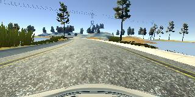

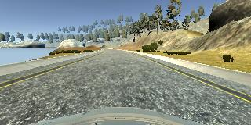

I then recorded the vehicle recovering from the left side and right sides of the road back to center so that the vehicle would learn to recover from oversteer and understeer. These images show what a recovery looks like ranging from the left right and out of track.

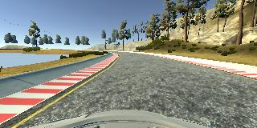

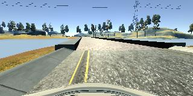

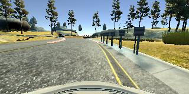

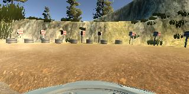


Then I repeated this process on track two in order to get more data points.

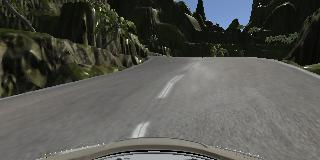

To augment the data sat, I also flipped images and angles thinking that this would balance out the training data because majority of turns are left turns. Here are images that has then been flipped:

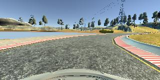
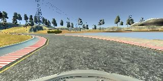

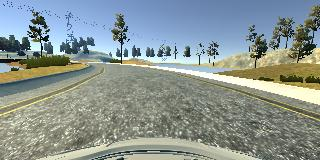
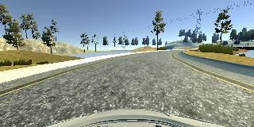


Total images collected was 12129. After augmented process, I had 24258 to used as my dataset. I then mean normalizing using keras lambda layer.

```python
model.add(Lambda(lambda x: (x / 255.0)-0.5))
```


I finally randomly shuffled the data set and put 20% of the data into a validation set.

I used this training data for training the model. The validation set helped determine if the model was over or under fitting. The ideal number of epochs was 3 as evidenced by the fact that after 3rd epoch the training error keep reducing but the validation error was fluctuate higher. I used an adam optimizer so that manually training the learning rate wasn't necessary.
